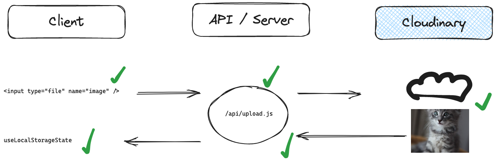

# Kitten Cloud (Cloudinary Image Upload Demo)

This project demonstrates how to upload images to Cloudinary using Next.js API routes.



## `pages/index.js`

`pages/index.js` contains a form that allows you to upload an image to the `api/upload` route using fetch.
It then displays all uploaded images from a state persisted in local storage.

## `pages/api/upload.js`

`pages/api/upload.js` contains the route that handles the image upload.

- It uses the `formidable` package to parse the incoming request.
- It uses the `cloudinary` package to upload the image to Cloudinary.

## Cloudinary

You need to set up cloudinary account and create a cloudinary project to use this demo.

Set these environment variables in your `.env.local` file or in your deployment environment:

```bash
CLOUDINARY_CLOUD_NAME=
CLOUDINARY_API_KEY=
CLOUDINARY_API_SECRET=
```

## Template

This project was created from the neue fische `next` template.

You can [🔗 **use this template on CodeSandbox**](https://codesandbox.io/p/sandbox/github/neuefische/web-exercises/tree/main/templates/next?file=/README.md) or locally by running this command in your Terminal:

```bash
npx -y ghcd@latest neuefische/web-exercises/tree/main/templates/next my-app -i
```

## Development

### Local Development

To work locally, please install the dependencies using `npm i` first.

Run `npm run dev` to start a development server and open the displayed URL in a browser.

Use `npm run test` to run the tests.

### CodeSandbox Cloud

Select the "Preview: 3000" tab to view this project.

Select the "Tests: logs" tab to view the tests.

> The `npm run dev` and `npm run test` scripts run automatically.

### Scripts

You can use the following commands:

- `npm run dev` to start a development server
- `npm run build` to build the project
- `npm run start` to start a production server
- `npm run test` to run the tests
- `npm run lint` to run the linter
